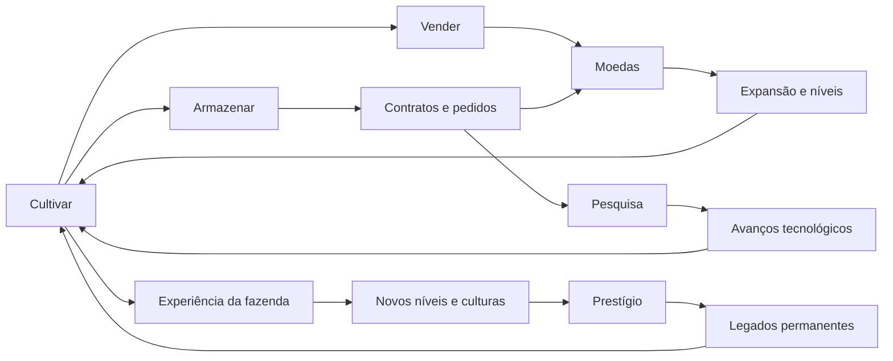
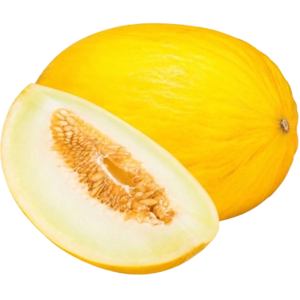
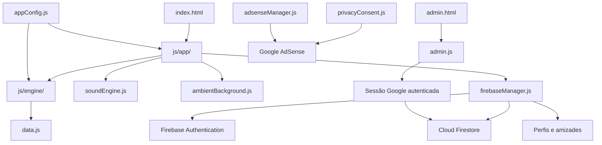

<p align="center">
  <a href="https://fazenda-serena.web.app/">
    
  </a>
</p>

<h1 align="center">Fazenda Serena</h1>

<p align="center">
  <strong>Um jogo idle de agricultura, produção, comércio e evolução para navegador.</strong>
</p>

<p align="center">
  Construa uma fazenda cada vez mais eficiente, descubra novas culturas, administre o estoque,
  negocie com empresas, desenvolva pesquisas e transforme cada nova jornada em um legado permanente.
</p>

<p align="center">
  <a href="https://fazenda-serena.web.app/"><strong>Jogar Fazenda Serena</strong></a>
  &nbsp;•&nbsp;
  <a href="https://fazenda-serena.web.app/privacy.html">Privacidade e cookies</a>
  &nbsp;•&nbsp;
  <a href="LICENSE">Licença do projeto</a>
</p>

<p align="center">
  
  
  
  
</p>

---

## Sobre o jogo

**Fazenda Serena** é um jogo incremental de fazenda desenvolvido para a web. A experiência começa com uma pequena produção e cresce progressivamente até se transformar em uma operação agrícola completa, formada por dezenas de culturas, contratos comerciais, pesquisas e bônus permanentes.

O jogador acompanha a produção em tempo real, decide o que armazenar ou vender, desenvolve cada plantação individualmente e administra três recursos principais:

- **Moedas**, utilizadas para adquirir culturas, elevar plantações e ampliar o armazenamento;
- **Pontos de pesquisa**, investidos em avanços técnicos e melhorias especializadas;
- **Pontos de prestígio**, usados em legados que permanecem entre diferentes jornadas.

A versão **1.0.0** representou o primeiro lançamento público estável do projeto e a saída oficial de sua fase beta. A linha **1.0.1** reorganiza a navegação e concentra a evolução da jornada exclusivamente em pesquisas.

---

## Experiência de jogo

A progressão da Fazenda Serena foi organizada em ciclos conectados. Cada sistema fortalece os demais e cria novas decisões conforme a fazenda cresce.



### Culturas e produção

O jogo possui **71 culturas**, distribuídas entre folhas e hortaliças, raízes e tubérculos, frutos, pomares, grãos, plantas tropicais, arbustos e culturas industriais.

Cada cultura possui identidade visual própria, nível individual, tempo de crescimento, rendimento, preço de venda e requisito de desbloqueio. A progressão apresenta uma nova cultura a cada cinco níveis da fazenda, ampliando gradualmente as possibilidades de produção.

<table>
  <tr>
    <td align="center"><br><sub>Cenoura</sub></td>
    <td align="center"><br><sub>Milho</sub></td>
    <td align="center"><br><sub>Morango</sub></td>
    <td align="center"><br><sub>Laranja</sub></td>
    <td align="center"><br><sub>Melão</sub></td>
    <td align="center"><br><sub>Café</sub></td>
    <td align="center"><br><sub>Graviola</sub></td>
  </tr>
</table>

### Estoque e mercado

A produção pode ser guardada em um estoque compartilhado, vendida manualmente ou direcionada à venda automática. A capacidade do estoque pode ser expandida diretamente, por pesquisas e por legados permanentes.

Entre os recursos avançados está a **Central atacadista**, que mantém a produção ativa mesmo quando o armazenamento chega ao limite. O excedente passa a ser vendido automaticamente no atacado por uma fração do valor normal, impedindo que a fazenda fique completamente parada.

### Escritório

O Escritório concentra a operação comercial e tecnológica da fazenda:

- **Contratos:** propostas de empresas com quantidades, prazos e recompensas diferentes;
- **Pedidos:** sequências progressivas de entregas para cada cultura;
- **Evoluções:** acesso ao Centro de Pesquisa, onde pontos de pesquisa desenvolvem tecnologias da jornada.

Os contratos são divididos em propostas comerciais, emergenciais e de grandes safras. Cada tipo prioriza aspectos diferentes da economia, como valor, prazo ou quantidade de pesquisa recebida.

### Evoluções e pesquisa

A partir da versão 1.0.1, os antigos aprimoramentos comprados com moedas foram aposentados. Toda evolução renovável da fazenda acontece por meio de **Pesquisas**, reunidas dentro do Escritório.

As tecnologias afetam velocidade de crescimento, rendimento, valor das vendas, capacidade do estoque, custos, experiência, contratos, pedidos e ganho passivo de experiência. Saves anteriores convertem automaticamente os antigos aprimoramentos na pesquisa equivalente.

### Perfil

O Perfil reúne sistemas ligados à identidade e ao histórico do jogador:

- **Conta:** autenticação com Google, save em nuvem, perfil público, ranking global, totais permanentes, recordes e conquistas;
- **Social:** solicitações, conexões entre fazendas, ranking global e a base para futuros eventos e disputas;
- **Missões:** séries de objetivos que permanecem entre jornadas;
- **Prestígio:** reinício de jornada e desenvolvimento de legados permanentes.

A administração não faz parte da interface do jogo. Ela possui uma página independente na rota `/administrador`, responsável por publicar equilíbrio e catálogos no Cloud Firestore. O painel exige autenticação Google e valida o acesso exclusivamente pela coleção `administrators` do Firestore; as regras não possuem um e-mail administrativo fixo.

### Prestígio

O prestígio é desbloqueado no nível 40. Ao iniciar uma nova jornada, parte do progresso atual é reiniciada em troca de pontos usados para construir um legado agrícola permanente.

Entre os legados estão bônus de produção, capital inicial, capacidade de armazenamento, geração passiva de experiência, geração passiva de pesquisa, venda atacadista e novos espaços para contratos ativos.

### Perfil e ranking

Jogadores conectados podem definir um apelido e escolher um avatar animal para participar do ranking global de prestígio. O mesmo perfil também gera um código de amizade, utilizado para enviar solicitações e manter uma lista de fazendas conectadas entre diferentes dispositivos.

As amizades formam a camada social do projeto e foram estruturadas para receber futuramente eventos cooperativos, desafios por período e disputas como a comparação de contratos concluídos. O perfil público exibe apenas apelido, avatar e identificadores necessários para esses recursos, enquanto o progresso completo permanece associado à conta autenticada.

<table>
  <tr>
    <td align="center"><br><sub>Arara</sub></td>
    <td align="center"><br><sub>Rinoceronte</sub></td>
    <td align="center"><br><sub>Raposa</sub></td>
    <td align="center"><br><sub>Borboleta</sub></td>
    <td align="center"><br><sub>Panda</sub></td>
    <td align="center"><br><sub>Gavião</sub></td>
    <td align="center"><br><sub>Lontra</sub></td>
  </tr>
</table>

---

## Identidade visual e sonora

A interface foi criada para transmitir uma atmosfera tranquila sem abandonar a sensação de crescimento constante de um jogo incremental. O projeto combina cartões de informação, cores naturais, imagens próprias para as culturas, navegação por ícones e animações ambientais discretas.

O plano de fundo utiliza folhas sazonais e elementos animados para representar diferentes épocas do ano. A interface também foi adaptada para computadores, tablets e celulares, reorganizando navegação, cartões e painéis de acordo com o espaço disponível.

<table>
  <tr>
    <td align="center"><br><sub>Fazenda</sub></td>
    <td align="center"><br><sub>Estoque</sub></td>
    <td align="center"><br><sub>Escritório</sub></td>
    <td align="center"><br><sub>Perfil</sub></td>
    <td align="center"><br><sub>Pesquisa</sub></td>
    <td align="center"><br><sub>Prestígio</sub></td>
    <td align="center"><br><sub>Configurações</sub></td>
  </tr>
</table>

A ambientação sonora inclui **11 músicas de fundo** e **13 efeitos sonoros**, cobrindo navegação, compra e evolução de culturas, pesquisas, recompensas, vendas, contratos, aumento de nível, prestígio e movimentação dos contadores de recursos.

O motor de áudio possui controles independentes para volume geral, música e efeitos. As preferências são mantidas no save do jogador, e o volume inicial da música foi equilibrado para não competir com a interface.

---

## Composição do projeto

Na versão 1.0.1, o repositório contém **266 arquivos principais**. A maior parte do tamanho do projeto está concentrada nos recursos audiovisuais, especialmente nas músicas em formato WAV.

| Grupo | Conteúdo | Quantidade aproximada |
| --- | --- | ---: |
| Culturas | Ilustrações PNG utilizadas nos cartões e desbloqueios | 71 |
| Avatares | Personagens animais selecionáveis no perfil | 31 |
| Ícones | Navegação, recursos, empresas, ações e melhorias | 74 |
| Músicas | Faixas ambientais reproduzidas em loop | 11 |
| Efeitos sonoros | Sons de interface, recompensas e progressão | 13 |
| JavaScript | Motor, dados, interface, tutorial e integrações | 36 arquivos |
| CSS | Interface principal, revisões, administração, tutorial, monetização e documentos públicos | 6 arquivos |

Os recursos da pasta `assets/` representam mais de 99% do tamanho total do projeto. Os arquivos HTML, CSS e JavaScript concentram as regras, a interface e as integrações, mas ocupam uma parcela muito menor do armazenamento.

---

## Organização dos arquivos

```text
FazendaSerena/
├── assets/
│   ├── avatars/           # Avatares animais usados no perfil e no ranking
│   ├── icons/             # Ícones da interface, recursos, empresas e sistemas
│   ├── plants/            # Ilustrações individuais das 71 culturas
│   ├── sounds/
│   │   └── musicas/         # Músicas de fundo reproduzidas em loop
│   ├── autumn.png         # Folhas e elementos da estação de outono
│   ├── spring.png         # Folhas e elementos da estação de primavera
│   ├── summer.png         # Folhas e elementos da estação de verão
│   ├── winter.png         # Folhas e elementos da estação de inverno
│   └── logo.png           # Identidade principal do Fazenda Serena
│
├── css/
│   ├── style.css          # Design do jogo, componentes, animações e responsividade
│   ├── admin.css          # Interface exclusiva da administração
│   ├── monetization.css   # Blocos de publicidade e interface de consentimento
│   ├── privacy.css        # Apresentação da Política de Privacidade e Termos
│   ├── tutorial.css       # Interface isolada do tutorial interativo
│   └── revision-1.0.1.css # Ajustes e refinamentos específicos da versão 1.0.1
│
├── js/
│   ├── engine/            # Motor separado em produção, estoque, progressão e sistemas
│   ├── app/               # Interface separada em navegação, Social, cards e eventos
│   ├── data.js            # Estruturas do jogo e fallback local somente de pesquisas/legados
│   ├── firebaseManager.js # Autenticação, save, ranking, amizades e permissões
│   ├── firebase-config.js # Configuração pública do aplicativo Firebase
│   ├── soundEngine.js     # Música, efeitos, canais e preferências de volume
│   ├── ambientBackground.js # Folhas sazonais, orbes e ambiente animado
│   ├── avatars.js         # Catálogo e identificação dos avatares disponíveis
│   ├── privacyConsent.js  # Preferências de cookies e Google Consent Mode
│   ├── adsenseManager.js  # Carregamento e controle dos espaços publicitários
│   ├── adsense-config.js  # Identificadores públicos da integração com anúncios
│   ├── gameAdmin.js       # Modelo e validação das configurações administrativas
│   ├── admin.js           # Autenticação e interação da página administrativa
│   ├── adminCatalogEditor.js # Formulários e catálogos publicados no Firestore
│   ├── tutorial.js        # Simulação didática isolada do save real
│   └── appConfig.js       # Versão oficial e configurações globais centralizadas
│
├── index.html             # Estrutura principal da aplicação
├── admin.html             # Aplicação administrativa separada do jogo
├── tutorial.html          # Tutorial interativo sem vínculo com o save real
├── terms.html             # Termos de Uso
├── privacy.html           # Política de Privacidade e informações sobre cookies
├── firestore.rules        # Regras de acesso aos dados armazenados no Firestore
├── firebase.json          # Configuração de Hosting e cabeçalhos da aplicação
├── ads.txt                # Declaração pública de vendedores autorizados de anúncios
├── robots.txt             # Orientações para mecanismos de busca
├── sitemap.xml            # Endereços públicos indexáveis do projeto
├── CHANGELOG.md           # Histórico das versões e alterações do jogo
├── LICENSE                # Licença proprietária e condições de uso
└── README.md              # Apresentação geral do Fazenda Serena
```

### Núcleo JavaScript

O projeto utiliza JavaScript modularizado por responsabilidade, sem concentrar toda a aplicação em um único arquivo:

| Arquivo | Responsabilidade no projeto |
| --- | --- |
| `js/engine/` | Divide o motor entre núcleo do estado, produção, progressão, estoque, contratos, pedidos, missões, prestígio e formatação. |
| `js/app/` | Divide a interface entre estado visual, utilitários, Minha Conta e Social, navegação, culturas, evoluções, comércio, estatísticas, ações, eventos e inicialização. |
| `data.js` | Mantém as estruturas de dados do jogo; os catálogos de plantas, categorias, indústrias, contratos, pedidos e missões são carregados do Firestore. |
| `firebaseManager.js` | Controla login, sincronização do save, ranking, perfis sociais, amizades e configuração pública. |
| `soundEngine.js` | Gerencia músicas, efeitos simultâneos, transições e níveis de volume. |
| `ambientBackground.js` | Produz os movimentos visuais do cenário sem interferir nas regras da fazenda. |
| `privacyConsent.js` | Registra as escolhas de cookies e comunica o consentimento aos serviços do Google. |
| `adsenseManager.js` | Inicializa os espaços de anúncios quando as condições necessárias estão disponíveis. |
| `gameAdmin.js` | Define, normaliza e valida o conteúdo balanceável publicado pela administração. |
| `admin.js` | Controla a página administrativa independente, sua autenticação e seus editores. |
| `appConfig.js` | Atua como fonte única da versão pública e das configurações compartilhadas. |

### Camada de estilos

O CSS principal reúne o sistema visual do jogo, incluindo cartões, navegação, cabeçalhos, barras de progresso, janelas modais, painéis de evolução, escritório, estoque, perfil e adaptações responsivas.

Os estilos relacionados a administração, publicidade e privacidade ficam separados para que esses componentes tenham manutenção independente da interface principal.

---

## Arquitetura da aplicação



A interface funciona no navegador e mantém as regras econômicas separadas da renderização visual. Essa divisão permite que o motor atualize a fazenda, enquanto a camada de interface apresenta o estado ao jogador e encaminha suas ações.

---

## Tecnologias e serviços

### HTML, CSS e JavaScript

A base do jogo foi desenvolvida com tecnologias nativas da web. O HTML define a estrutura acessível das telas, o CSS constrói a identidade visual e os comportamentos responsivos, e o JavaScript executa o motor incremental e as interações.

### Firebase Hosting

A versão pública é distribuída pelo Firebase Hosting e está disponível em:

**[fazenda-serena.web.app](https://fazenda-serena.web.app/)**

### Firebase Authentication

O projeto utiliza o **Firebase Authentication** com login pelo Google. A autenticação identifica o jogador, permite associar seu progresso a uma conta e habilita a participação no ranking global quando o perfil é configurado.

### Cloud Firestore

O **Cloud Firestore** armazena o save em nuvem, os dados públicos necessários para o ranking, os perfis sociais, as solicitações de amizade e a configuração publicada pela administração. Categorias de plantas, plantas, indústrias, tipos de contrato, etapas de pedidos e missões são catálogos remotos: não possuem conteúdo padrão embutido no jogo e passam a existir quando são cadastrados e publicados pelo painel administrativo.

Jogadores não autenticados podem conhecer o jogo como visitantes, enquanto contas conectadas recebem sincronização automática do progresso.

### Recursos visuais locais

As imagens, ícones, avatares, músicas e efeitos do **Fazenda Serena** são arquivos estáticos do próprio projeto. O painel administrativo seleciona recursos já existentes no repositório e não realiza upload de imagens.

### Tutorial e documentos públicos

O projeto inclui um tutorial interativo em `tutorial.html`, totalmente isolado do save real, além de `privacy.html`, `terms.html` e da licença proprietária do projeto.

### Google AdSense

A monetização do projeto utiliza **Google AdSense**. Os espaços publicitários foram integrados à interface para apoiar a manutenção do jogo sem fazer parte das mecânicas de progressão.

O arquivo `ads.txt` informa publicamente ao ecossistema de publicidade quais vendedores estão autorizados a representar o site.

### Cookies e consentimento

O Fazenda Serena utiliza cookies necessários ao funcionamento das preferências e integrações do site. A publicidade faz parte da operação da versão pública, enquanto a análise de uso pode ser configurada pelo visitante.

A página de Privacidade descreve as categorias utilizadas, os serviços externos envolvidos e as formas de gerenciar as preferências disponíveis.

---

## Salvamento e dados do jogador

O save reúne o estado econômico e a progressão da fazenda, incluindo moedas, culturas adquiridas, níveis, estoque, pesquisas, legados, contratos, pedidos, missões, estatísticas, perfil e preferências de áudio. As amizades são mantidas separadamente, no nível da conta, para continuarem disponíveis entre dispositivos e futuras jornadas.

Quando o jogador está autenticado, esse estado é sincronizado com o Firestore. O sistema também controla a versão do save para preservar a compatibilidade entre atualizações do jogo.

O ranking utiliza uma representação pública reduzida, composta somente pelos dados necessários para identificar e posicionar o jogador, como apelido, avatar e prestígio. O sistema social mantém outro perfil mínimo para apresentar amigos e solicitações sem expor o conteúdo completo do save.

---

## Versão

A versão atual é **1.0.1 — Release**.

A identificação pública da versão é centralizada em `js/appConfig.js`. Essa informação é reutilizada pela interface, pelo motor e pelos dados salvos, evitando referências divergentes espalhadas pelo código.

---

## Direitos autorais

**Fazenda Serena é um projeto proprietário protegido por direitos autorais.**

A presença do código-fonte neste repositório não concede autorização para copiar, modificar, redistribuir, republicar, hospedar, vender ou utilizar comercialmente o jogo, suas imagens, seus áudios, sua identidade visual ou partes de sua implementação.

O acesso público ao repositório tem finalidade de apresentação, acompanhamento do desenvolvimento e registro do projeto. As condições completas estão descritas no arquivo [`LICENSE`](LICENSE).

Componentes e serviços de terceiros permanecem sujeitos aos termos e licenças de seus respectivos proprietários.

---

## Projeto oficial

- **Jogo:** [fazenda-serena.web.app](https://fazenda-serena.web.app/)
- **Repositório:** [github.com/kaikedandrade/paisagemserena](https://github.com/kaikedandrade/paisagemserena)
- **Privacidade:** [fazenda-serena.web.app/privacy.html](https://fazenda-serena.web.app/privacy.html)
- **Versão:** 1.0.1

<p align="center">
  
</p>

<p align="center">
  <strong>Fazenda Serena</strong><br>
  Cultive. Evolua. Construa um legado.
</p>

